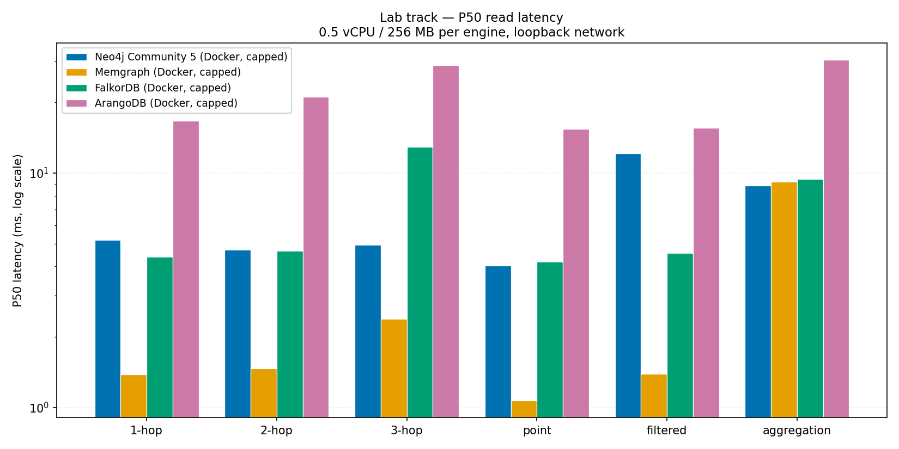
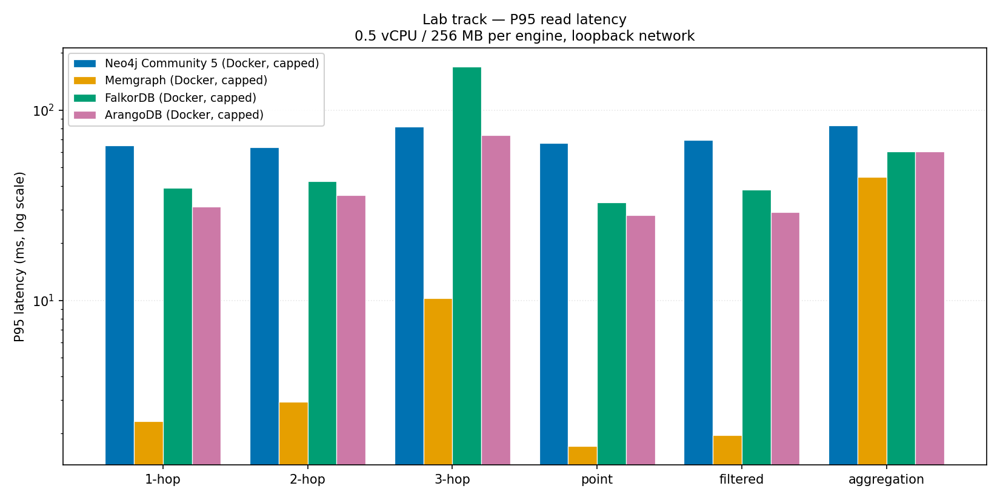
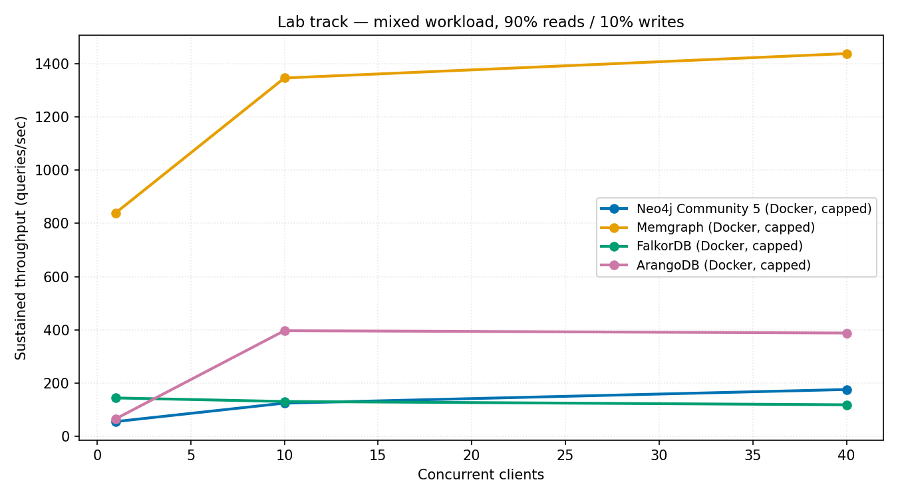
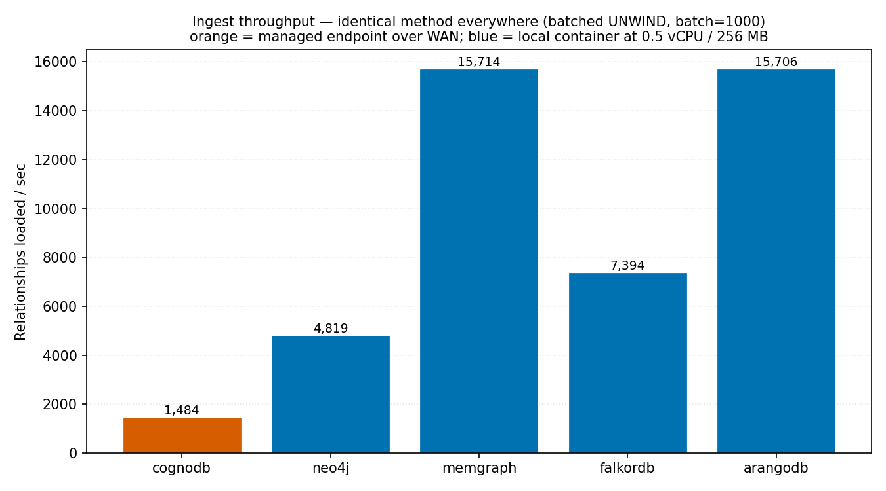

# Benchmarking CognoDB Cloud against four graph databases

A reproducible latency, throughput and correctness comparison of **CognoDB Cloud** with
**Neo4j Community**, **Memgraph**, **FalkorDB** and **ArangoDB**, on the same dataset, the
same logical workloads and the same resource envelope.

*Wexa AI take-home — Graph Database Cloud Benchmarking.*

The headline result is not which database is fastest. It is that **the first version of
this benchmark was measuring the wrong things**, in four separate ways, and each one would
have produced a confident, plausible, wrong chart:

- **Two engines silently returned incorrect results** — CognoDB on cyclic paths, FalkorDB
  understating traversals by up to 37%. FalkorDB's error made it look *faster*, because
  returning fewer results is less work.
- **One engine was being overcharged ~10×** by a transport artifact that had nothing to do
  with the database.
- **The dataset itself lost every paper from 2000–2002** to a silent join failure,
  corrupting two workloads on all five platforms equally.

None of these raised an error. All were caught by checking results against independently
computed ground truth. They are documented in [Correctness findings](#correctness-findings),
because a latency number attached to a wrong answer is worse than no number at all.

---

## Contents

- [Assignment requirement coverage](#assignment-requirement-coverage)
- [What was measured](#what-was-measured)
- [Environment and instance specs](#environment-and-instance-specs)
- [Why two tracks](#why-two-tracks)
- [Databases selected, and why](#databases-selected-and-why)
- [Dataset](#dataset)
- [Methodology](#methodology)
- [The exact logical queries](#the-exact-logical-queries)
- [Correctness findings](#correctness-findings)
- [Results](#results)
- [Analysis](#analysis)
- [Fairness limitations and caveats](#fairness-limitations-and-caveats)
- [Reproducing this benchmark](#reproducing-this-benchmark)
- [Repository layout](#repository-layout)
- [Extending the harness](#extending-the-harness)

---

## Assignment requirement coverage

Every requirement in the brief, mapped to where it is satisfied. A line-by-line audit,
including the gaps, is in [COMPLIANCE.md](COMPLIANCE.md).

| § | Requirement | Where |
|---|---|---|
| 3 | CognoDB free `c0` instance, official Neo4j driver, credentials from env | [benchmarks/adapters/bolt.py](benchmarks/adapters/bolt.py), [.env.example](.env.example) |
| 4 | CognoDB + **four** other graph databases, equal resources, specs documented | [Databases selected](#databases-selected-and-why), [Environment and instance specs](#environment-and-instance-specs) |
| 5.1 | Public dataset ≥ 100k relationships, identical everywhere, load method stated | [Dataset](#dataset) — SNAP cit-HepPh, **421,578** relationships |
| 5.2 | Ingest, 1/2/3-hop, point + filtered lookup, aggregation, mixed workload, footprint | [Results](#results) — every metric, every platform |
| 5.2 | ≥ 100 iterations after warm-up, percentiles not averages | 100 measured iterations; p50/p90/p95/p99 in [results/results.csv](results/results.csv) |
| 5.3 | Same resources, same dataset, same logical queries, same client | [Methodology](#methodology) — verified at the Docker daemon level |
| 5.3 | Warm up; report cold start separately | 20 untimed warm-up; [cold-start table](#cold-start-first-five-operations-after-connecting) |
| 5.3 | Automate everything | Four scripts: prepare → load → run → report |
| 5.3 | Record every caveat honestly | [Caveats](#fairness-limitations-and-caveats) (10) + [Correctness findings](#correctness-findings) (4) |
| 6 | Code, reproducible instructions, results matrix, charts, analysis | This README + [scripts/](scripts/) + [results/](results/) |
| 7 | Concurrency sweep, warm vs cold, root-cause reasoning, extensible harness | 1/10/40 clients; [Analysis](#analysis); [Extending](#extending-the-harness) |
| 9 | No passwords or connection URIs in the repository | All credentials via `.env`; see [Security](#security) |

Two things the brief asks for that this submission does **not** yet have: repeat-run
variance across multiple runs, and a public write-up. Both are stated as gaps in
[COMPLIANCE.md](COMPLIANCE.md) rather than glossed over.

---

## What was measured

Every metric required by section 5.2, on every platform:

| Category | Metric | Reported as |
|---|---|---|
| Data loading | Ingest throughput | nodes/sec, relationships/sec, total wall-clock |
| Traversals | 1-hop, 2-hop, 3-hop | p50 and p95 (ms) from 200 fixed random start nodes |
| Lookups | Point lookup, indexed/filtered lookup | p50 and p95 (ms), index stated per platform |
| Aggregation | Group-by over a label | p50 and p95 (ms) |
| Mixed workload | Concurrent read/write | sustained QPS at 1 / 10 / 40 clients, 90/10 read/write |
| Footprint | Resource usage where observable | memory / store size / counts, or "not observable" |

Percentiles use the **nearest-rank** method (`ceil(p/100 × n)` on sorted samples), so every
reported value is one that an actual request experienced rather than an interpolation.
Every individual latency sample is committed under
[results/raw/](results/raw/), so any reviewer preferring a different percentile definition
can recompute from the same data.

---

## Environment and instance specs

### Client machine — identical for every measurement

| Property | Value |
|---|---|
| OS | Windows 11 (10.0.26200) |
| CPU | 12 physical / 16 logical cores |
| RAM | 16.83 GB |
| Python | 3.11.7 |
| Location | India |
| Drivers | `neo4j` 6.2.0, `falkordb` 1.7.1, `python-arango` 8.3.3, `redis` 8.1.0 |

Recorded automatically into the `manifest` block of
[results/results-lab.json](results/results-lab.json) and
[results/results-cloud.json](results/results-cloud.json) at run time, along with the git
SHA and the sha256 of every dataset file.

### Tier parity — advertised specs per platform

CognoDB's free tier sets the envelope; every other database is capped to match it.

| Platform | Tier | vCPU | RAM | Disk | Region | Enforcement |
|---|---|---|---|---|---|---|
| CognoDB Cloud | free `c0` | 0.5 (burstable) | 256 MB | 1 GB | us-east | vendor-managed, as advertised |
| Neo4j Community 5.26 | self-hosted | 0.5 | 256 MB | 1 GB¹ | local | Docker `cpus: 0.5`, `mem_limit: 256m` |
| Memgraph 2.22 | self-hosted | 0.5 | 256 MB | 1 GB¹ | local | Docker + `--memory-limit=200` |
| FalkorDB 4.2.2 | self-hosted | 0.5 | 256 MB | 1 GB¹ | local | Docker `cpus: 0.5`, `mem_limit: 256m` |
| ArangoDB 3.11.10 | self-hosted | 0.5 | 256 MB | 1 GB¹ | local | Docker `cpus: 0.5`, `mem_limit: 256m` |

¹ Disk is **not** capped per container — `--storage-opt size=` requires a storage driver
unavailable on Docker Desktop for Windows. The prepared dataset is ~50 MB on disk, far
below 1 GB everywhere, so disk was never the binding constraint. Recorded rather than
silently ignored.

Caps are verified at the daemon level, not merely declared in a compose file:

```
$ docker inspect bench-neo4j --format '{{.HostConfig.NanoCpus}} {{.HostConfig.Memory}}'
500000000 268435456          # 0.5 vCPU, 256 MiB
```

Neo4j additionally needs its JVM sized to fit: heap 96 MB, page cache 64 MB (see
[docker-compose.yml](docker-compose.yml)). Those values were chosen up front to make it
start at all, not tuned against alternatives.

---

## Why two tracks

The assignment requires equivalent vCPU/RAM/storage on every platform, and separately
requires the *same client machine and region*. With a free CognoDB instance those two rules
pull in opposite directions, so the benchmark is split into two tracks that are each
internally fair. **Latency is never compared across tracks.**

### Lab track — controlled engine comparison

Neo4j, Memgraph, FalkorDB and ArangoDB run in Docker, hard-capped to CognoDB's advertised
free-tier spec of 0.5 vCPU / 256 MB. All four are reached over loopback, so latency is
close to pure engine time.

### Cloud track — managed endpoint, as delivered

CognoDB Cloud is measured over the public internet from the same client machine.

**This is why the split exists.** CognoDB's free tier is offered in `us-east` only, and the
benchmark client is in India. The measured TCP handshake floor — no TLS, no protocol, no
query, no database — is:

| Path | TCP p50 | TCP p95 |
|---|---|---|
| CognoDB endpoint (us-east) | 471.89 ms | 759.58 ms |
| Local Docker containers | 0.44 – 0.55 ms | 13.5 – 15.5 ms |

That is roughly a **1000× transport difference before any database does any work**. A
1-hop traversal over 34k nodes is single-digit milliseconds of engine time, so a combined
chart would report the client's internet connection, not the databases. Publishing that as
"CognoDB is 400× slower than Memgraph" would be false.

The honest consequence, stated plainly: **this benchmark cannot isolate CognoDB's engine
performance.** What it can do is measure CognoDB's end-to-end behaviour as a user in India
actually experiences it, verify its correctness rigorously, and compare its ingest
throughput, concurrency scaling and query semantics against the others.

To make the cloud track a real comparison rather than a single data point, provisioning
**Neo4j AuraDB Free in us-east** gives CognoDB a managed peer over the identical WAN link
from the identical client. See [.env.example](.env.example) — the harness picks it up
automatically when `NEO4J_AURA_URI` is set, and skips it silently otherwise. It was not
provisioned for this run, which is the single highest-value addition to the benchmark.

---

## Databases selected, and why

Selection was constrained by one rule: every competitor must be runnable **at 0.5 vCPU /
256 MB**. That eliminated more candidates than it admitted.

| Database | Why it earns a slot |
|---|---|
| **Neo4j Community 5.26** | The incumbent, and the reference implementation for Bolt/Cypher. CognoDB is driven by the official Neo4j driver, so this isolates *platform* differences from *language* differences with zero query-translation risk. |
| **Memgraph 2.22** | In-memory C++ engine speaking the same Cypher. Same language, opposite storage architecture — isolates architecture from dialect. |
| **FalkorDB 4.2** | Sparse-matrix / GraphBLAS execution over the RESP protocol. A genuinely different evaluation model, and the most likely to thrive in 256 MB. |
| **ArangoDB 3.11** | Multi-model, queried in **AQL, not Cypher**. Deliberately included to force the "equivalent logical workload, not identical syntax" discipline the assignment asks for. |

**Rejected, and why** — documenting these is part of the methodology:

| Rejected | Reason |
|---|---|
| Amazon Neptune | No free tier; smallest instance far exceeds 256 MB. Including it *would itself be* the methodology error the assignment warns about. |
| JanusGraph | Requires a Cassandra/ScyllaDB backend. Cannot fit the resource envelope. |
| NebulaGraph | Three separate services (meta/storage/graph); will not run meaningfully in 256 MB. |
| TigerGraph | Heavyweight footprint and a slow signup path for a time-boxed comparison. |

---

## Dataset

**SNAP cit-HepPh** — the arXiv High Energy Physics (phenomenology) citation network.
Source: <https://snap.stanford.edu/data/cit-HepPh.html>

| Property | Value |
|---|---|
| Nodes (papers) | **34,546** |
| Relationships (`:CITES`) | **421,578** |
| Nodes with a `year` property | 30,561 (**88.46%**) |
| Year range | 1992 – 2002 |
| On-disk size (prepared CSV) | ~8 MB |
| Loaded in full on every platform | yes — no sampling was needed |

421,578 relationships sits inside the assignment's suggested 100k–500k range, and the full
graph fit every platform including CognoDB's 1 GB free tier, so no down-sampling was
applied. `scripts/prepare_dataset.py --edges N` supports a deterministic seeded subset if a
tighter tier ever requires one.

The prepared `nodes.csv` / `edges.csv` are sha256-hashed into
[data/prepared/manifest.json](data/prepared/manifest.json), which **is** committed, so a
reviewer can prove they built a byte-identical dataset before comparing numbers.

### The dataset defect that had to be fixed first

A naive join of the citation graph to `cit-HepPh-dates.txt` matches only **62.9%** of nodes
and produces a year range that stops at **1999**. Both symptoms have the same cause:

- Node IDs in the edge file have had **leading zeros stripped** (observed lengths 4/5/6/7).
- The dates file keeps the full 7 digits and prefixes **cross-listed papers with `11`**.

So every paper from 2000–2002 — arXiv IDs beginning `00`, `01`, `02` — silently fails to
join and vanishes from the properties. Normalising both sides fixes it:

```python
def normalise_id(paper_id: str) -> str:
    if len(paper_id) > 7 and paper_id.startswith("11"):
        paper_id = paper_id[2:]      # cross-listed prefix
    return paper_id.zfill(7)         # restore stripped leading zeros
```

Coverage rises to **88.46%** and the range extends to its true **1992–2002**. This matters
because `year` drives both the filtered-lookup and aggregation workloads.
[tests/](tests/) asserts the coverage so the fix cannot silently regress.

The remaining 11.54% of nodes are papers cited from outside the hep-ph category. They
**keep their edges** — the traversal topology depends on them — but carry a null year.

---

## Methodology

### The single most important fairness control

**Every database is queried from the identical list of 200 start nodes, in the identical
order.** The list is generated once by `prepare_dataset.py` with a fixed seed
(`BENCH_SEED=42`), written to `data/prepared/start_nodes.json`, and reused byte-for-byte by
every engine and every run.

If each database drew its own random start nodes it would face a different fan-out, and the
resulting p95 values would describe the graph rather than the engine. Measured fan-out of
the chosen set:

| Depth | min | p50 | max |
|---|---|---|---|
| 1-hop | 1 | 10 | 109 |
| 2-hop | 1 | 71 | 1,024 |
| 3-hop | 1 | 355 | 3,898 |

### Measurement procedure

Per database, per workload, in this order:

1. **Cold samples** — the first 5 operations after connecting, recorded separately and
   never mixed into the warm percentiles.
2. **Warm-up** — 20 untimed iterations, discarded.
3. **Measured run** — 100 iterations (the assignment's suggested floor), arguments cycled
   deterministically so every engine issues the same sequence.

Failures are recorded, never dropped. A database erroring on 30% of queries would otherwise
show a flatteringly clean p95.

### Correctness checking

Every read workload is checked against **ground truth precomputed from the source data** by
`prepare_dataset.py` — not merely cross-checked between engines, since five databases
agreeing on a wrong answer would pass that test. This is what caught findings 1 and 2 below.

### Concurrency

Threads, not asyncio — all three drivers are synchronous, and a thread pool is trivially
explainable. Each worker holds its own session (adapters keep sessions thread-local), so
the pool measures server concurrency rather than client contention. Writes go to an
isolated `:BenchWrite` namespace and are deleted afterwards, so the measured read dataset is
never mutated and runs stay repeatable.

Swept at **1 / 10 / 40 clients**, 90/10 read/write, 20 s per level.

### Loading

Every platform is loaded by the **same logical method** — driver-batched `UNWIND` (or the
AQL equivalent), identical batch size of 1000, same client — so the throughput numbers
compare databases rather than comparing bulk-import tools.

Each engine has a faster native importer (`neo4j-admin import`, `arangoimport`, and so on).
None was used, because using a different tool per platform would measure the tools. This is
a deliberate choice that makes all reported ingest numbers *lower* than each vendor's best.

### Indexes

Stated per platform, since the assignment asks:

| Platform | Indexes created |
|---|---|
| CognoDB / Neo4j / Aura | `CREATE INDEX FOR (n:Paper) ON (n.id)`, `... ON (n.year)` |
| Memgraph | `CREATE INDEX ON :Paper(id)`, `CREATE INDEX ON :Paper(year)` |
| FalkorDB | `CREATE INDEX ON :Paper(id)`, `CREATE INDEX ON :Paper(year)` |
| ArangoDB | `_key` primary index (automatic, used by point lookup) + persistent index on `year` |

---

## The exact logical queries

Defined once in [benchmarks/workloads.py](benchmarks/workloads.py) and implemented per
dialect in [benchmarks/adapters/](benchmarks/adapters/). Same logical question everywhere;
the syntax differs only where the engine forces it.

**Bolt/Cypher — CognoDB, Neo4j, Memgraph:**

```cypher
-- traversals, k = 1, 2, 3
MATCH (n:Paper {id: $id})-[:CITES*1..k]->(m) WHERE m <> n RETURN count(DISTINCT m) AS c
-- point lookup
MATCH (n:Paper {id: $id}) RETURN n.year AS year
-- indexed/filtered lookup
MATCH (n:Paper) WHERE n.year = $year RETURN count(n) AS c
-- aggregation
MATCH (n:Paper) WHERE n.year IS NOT NULL RETURN n.year AS year, count(*) AS c ORDER BY year
-- write (mixed workload only, isolated namespace)
CREATE (w:BenchWrite {key: $key}) RETURN 1 AS c
```

**ArangoDB — AQL:**

```aql
LET reached = (FOR v IN 1..@depth OUTBOUND @start cites
                 OPTIONS {uniqueVertices: 'global', bfs: true}
                 FILTER v._key != @key
                 RETURN v._key)
RETURN LENGTH(reached)
```

**FalkorDB** runs the same Cypher for lookups and aggregation, but its traversals are
rewritten as an explicit union of depths because its ranged `*1..k` form returns wrong
answers — see [finding 2](#2-falkordbs-ranged-variable-length-traversal-is-lossy).

The `WHERE m <> n` clause is not incidental: it is the resolution to
[finding 1](#1-cognodb-drops-variable-length-paths-that-return-to-the-origin).

---

## Correctness findings

### 1. CognoDB drops variable-length paths that return to the origin

Measured on the loaded dataset, start node `0001222`:

| Query | Neo4j | CognoDB |
|---|---|---|
| `(a)-[:CITES]->(b)-[:CITES]->(a)` explicit | 1 | 1 |
| `(a)-[:CITES*1..2]->(a)` variable-length | 1 | **0** |
| `(a)-[:CITES*1..2]->(m)` distinct count | 24 | **23** |

The explicit two-step pattern finds the cycle on both engines; only the variable-length form
differs. With 44 self-loops in the graph and 9 of the 200 start nodes sitting on a ≤3-hop
cycle, this changed the answer on ~5% of start nodes.

**Resolution:** all traversal workloads now ask for *other* reachable papers
(`WHERE m <> n`), which is unambiguous, is the more natural question, and makes every
engine agree exactly. Reported here because it is a genuine platform difference in
CognoDB's Cypher implementation.

### 2. FalkorDB's ranged variable-length traversal is lossy

The more serious finding. Start `0001222`, target `9308262`, via intermediate `9907378`:

| Query | Result |
|---|---|
| `-[:CITES*2..2]->` (exact depth) | 1 — found |
| `-[:CITES*1..2]->` (range) | **0 — missing** |
| `-[:CITES]->(:Paper {id:'9907378'})-[:CITES]->` (explicit) | 1 — found |

The exact-depth form and the explicit pattern both find the node; only the **range** form
drops it. FalkorDB appears to stop expanding a node once it has been emitted at a shallower
depth, so anything reachable only *through* a depth-1 neighbour is lost.

Impact on the measured workloads: 2-hop counts understated by up to **27%** (23 → 17) and
3-hop by up to **37%** (912 → 595). The data itself is intact — relationship count and
per-node out-degrees match the source file exactly.

**Resolution:** FalkorDB's traversals are rewritten as an explicit union of depths, which
matches ground truth on every start node. This is a different query *shape* from the one the
Bolt engines run and plausibly changes FalkorDB's traversal latency — flagged rather than
buried.

### 3. ArangoDB was being overcharged ~10× by a transport artifact

Not a database defect, but it would have been published as one. With python-arango's
default pooled keep-alive session, every request through Docker Desktop's Windows port
forwarder stalls on a ~40 ms timer:

| Client configuration | p50 |
|---|---|
| Pooled keep-alive (library default) | 44.2 ms |
| Client-side `TCP_NODELAY` | 43.9 ms — no help |
| `Connection: close` | **4.1 ms** |

A *fresh* connection being 9× faster than a pooled one is backwards for any real engine
cost, which is what identified it as transport. The adapter now forces a new connection per
request.

**Trade-off, stated honestly:** ArangoDB now pays a TCP handshake on every query (~0.5 ms
on loopback) that the Bolt targets amortise over a persistent connection. ArangoDB's
reported latency is therefore slightly *pessimistic* rather than flattering.

### 4. A driver-usage trap that would have doubled CognoDB's latency

`driver.execute_query()` opens a fresh session per call, costing an extra network round
trip. Over a ~390 ms WAN link that is not a rounding error:

| Driver usage | CognoDB p50 |
|---|---|
| `execute_query()` (session per call) | 891 ms |
| Persistent session | **438 ms** |

All Bolt adapters hold a long-lived, thread-local session. Worth noting for anyone
benchmarking a remote Bolt endpoint.

---

## Results

All tables below are generated by `scripts/make_report.py` from
[results/results-lab.json](results/results-lab.json) and
[results/results-cloud.json](results/results-cloud.json). Machine-readable copies:
[results/results.csv](results/results.csv), [results/tables.md](results/tables.md). Every
individual sample is in [results/raw/](results/raw/).

**Run configuration:** 100 measured iterations after 20 warm-up, 5 cold samples captured
separately, 200 fixed start nodes, mixed workload 90/10 read/write for 20 s per level.
Run ids `lab-final` and `cloud-final`, 2026-08-20.

### Correctness against ground truth

Checked first, because the latency tables mean nothing without it.

| Database | 1-hop | 2-hop | 3-hop | Point | Filtered | Aggregation |
|---|---|---|---|---|---|---|
| Neo4j Community 5 | ✅ | ✅ | ✅ | ✅ | ✅ | ✅ |
| Memgraph | ✅ | ✅ | ✅ | ✅ | ✅ | ✅ |
| FalkorDB | ✅ | ✅ | ✅ | ✅ | ✅ | ✅ |
| ArangoDB | ✅ | ✅ | ✅ | ✅ | ✅ | ✅ |
| CognoDB Cloud | ✅ | ✅ | ✅ | ✅ | ✅ | ✅ |

All 30 checks pass, with **zero failed operations**, after the fixes described in
[Correctness findings](#correctness-findings). All five databases hold the complete
34,546-node / 421,578-relationship graph.

### Data loading (identical method everywhere)

| Database | Track | Nodes/sec | Relationships/sec | Nodes (s) | Rels (s) | Total (s) |
|---|---|---|---|---|---|---|
| CognoDB Cloud (free c0) | cloud | 1,322 | 1,484 | 26.1 | 284.2 | 310.3 |
| Neo4j Community 5 | lab | 2,176 | 4,819 | 15.9 | 87.5 | 103.4 |
| Memgraph | lab | 16,701 | 15,714 | 2.1 | 26.8 | 28.9 |
| FalkorDB | lab | 16,756 | 7,394 | 2.1 | 57.0 | 59.1 |
| ArangoDB | lab | 18,509 | 15,706 | 1.9 | 26.8 | 28.7 |

Batch size 1000 on every platform. Method: driver-batched `UNWIND` (AQL `INSERT` for
ArangoDB).

### Network baseline — transport measured separately from engine time

| Database | Track | TCP p50 (ms) | TCP p95 (ms) |
|---|---|---|---|
| Neo4j Community 5 | lab | 0.48 | 13.46 |
| Memgraph | lab | 0.44 | 15.50 |
| FalkorDB | lab | 0.55 | 13.54 |
| ArangoDB | lab | 0.53 | 15.53 |
| **CognoDB Cloud** | cloud | **471.89** | **759.58** |

Raw TCP handshake — no TLS, no protocol, no query, no database.

### Lab track — warm read latency (p50 / p95 ms), 0.5 vCPU / 256 MB each

| Workload | Neo4j | Memgraph | FalkorDB | ArangoDB |
|---|---|---|---|---|
| 1-hop | 5.17 / 65.09 | **1.38 / 2.32** | 4.39 / 38.88 | 16.70 / 31.08 |
| 2-hop | 4.70 / 63.55 | **1.47 / 2.93** | 4.67 / 42.38 | 21.14 / 35.83 |
| 3-hop | 4.95 / 81.97 | **2.39 / 10.29** | 12.95 / 168.74 ¹ | 28.77 / 73.81 ² |
| Point lookup | 4.03 / 67.24 | **1.07 / 1.72** | 4.17 / 32.76 | 15.39 / 27.95 |
| Filtered lookup (indexed) | 12.12 / 69.39 | **1.39 / 1.96** | 4.55 / 38.19 | 15.58 / 29.19 |
| Aggregation (group-by) | **8.85** / 82.87 | 9.16 / 44.55 | 9.41 / 60.79 | 30.37 / 60.50 |

¹ FalkorDB runs a rewritten explicit-union query (see finding 2); not a like-for-like shape.
² ArangoDB uses `uniqueVertices: 'global'`, which prunes earlier than Cypher path expansion.

### Cloud track — CognoDB warm read latency (p50 / p95 ms)

| Workload | CognoDB Cloud (free c0) |
|---|---|
| 1-hop | 322.38 / 480.25 |
| 2-hop | 323.45 / 361.48 |
| 3-hop | 363.74 / 803.10 |
| Point lookup | 319.36 / 330.81 |
| Filtered lookup (indexed) | 324.23 / 339.11 |
| Aggregation (group-by) | 400.31 / 438.14 |

### Cold start — first five operations after connecting

Never mixed into the warm numbers above. Reported as **cold p50 / cold max (ms)**.

| Workload | Neo4j | Memgraph | FalkorDB | ArangoDB | CognoDB |
|---|---|---|---|---|---|
| 1-hop | 13.32 / 389.75 | 4.51 / 12.35 | 7.81 / 30.26 | 23.30 / 30.85 | 325.24 / 514.21 |
| 2-hop | 4.14 / 73.82 | 1.45 / 2.32 | 6.10 / 8.82 | 18.29 / 27.97 | 574.69 / 1259.83 |
| 3-hop | 5.70 / 45.80 | 1.60 / 4.63 | 5.23 / 25.76 | 17.03 / 23.18 | 347.05 / 542.68 |
| Point lookup | 5.17 / 80.05 | 1.66 / 2.22 | 4.31 / 4.50 | 15.21 / 28.89 | 317.34 / 327.35 |
| Filtered lookup | 8.71 / 84.61 | 3.21 / 5.79 | 4.14 / 4.76 | 25.71 / 30.57 | 320.41 / 332.48 |
| Aggregation | 67.74 / 283.65 | 8.39 / 8.76 | 7.85 / 42.06 | 29.47 / 42.74 | 397.95 / 448.02 |

The two engines that pay a visible cold-start penalty are the ones with a warm-up
dependency: Neo4j's first aggregation costs 67.74 ms against a warm 8.85 ms (JIT plus page
cache), and its worst cold 1-hop hits 389.75 ms. Memgraph, holding everything in RAM, is
essentially warm on arrival.

### Mixed read/write workload — 90% reads, full concurrency sweep

| Database | Clients | Sustained QPS | Read p50 / p95 (ms) | Write p50 / p95 (ms) | Errors |
|---|---|---|---|---|---|
| Neo4j | 1 | 56.3 | 5.22 / 73.69 | 7.74 / 71.53 | 0 |
| Neo4j | 10 | 125.4 | 93.93 / 105.53 | 98.83 / 196.32 | 0 |
| Neo4j | 40 | 176.6 | 181.59 / 307.88 | 233.41 / 1308.93 | **26** |
| Memgraph | 1 | 839.6 | 1.11 / 1.75 | 1.15 / 1.82 | 0 |
| Memgraph | 10 | 1,345.6 | 6.37 / 14.45 | 6.43 / 15.43 | 0 |
| Memgraph | 40 | **1,437.3** | 25.68 / 48.92 | 25.89 / 50.14 | 0 |
| FalkorDB | 1 | 144.9 | 4.59 / 36.33 | 1.39 / 20.80 | 0 |
| FalkorDB | 10 | 131.7 | 96.09 / 109.52 | 91.63 / 102.41 | 0 |
| FalkorDB | 40 | 119.3 ↓ | 301.31 / 500.42 | 496.44 / 1203.00 | 0 |
| ArangoDB | 1 | 66.7 | 15.38 / 29.98 | 15.08 / 30.08 | 0 |
| ArangoDB | 10 | 397.3 | 22.25 / 40.12 | 21.75 / 37.26 | 0 |
| ArangoDB | 40 | 388.6 | 99.69 / 152.64 | 97.70 / 152.76 | 0 |
| CognoDB (cloud) | 1 | 3.1 | 318.90 / 348.65 | 329.33 / 340.47 | 0 |
| CognoDB (cloud) | 10 | 28.2 | 315.77 / 473.72 | 328.60 / 371.19 | 0 |
| CognoDB (cloud) | 40 | 117.9 | 316.09 / 344.94 | 335.42 / 415.75 | 0 |

### Resource footprint

| Database | Enforced cap | Memory in use | % of cap | Engine-reported store | Server version |
|---|---|---|---|---|---|
| Neo4j Community 5 | 0.5 vCPU / 256 MB | 253.2 MiB | **98.90%** | not observable (needs APOC) | Neo4j Kernel 5.26.29 |
| ArangoDB | 0.5 vCPU / 256 MB | 172.5 MiB | 67.38% | not observable | 3.11.10 |
| Memgraph | 0.5 vCPU / 256 MB | 158.5 MiB | 61.92% | not observable | 2.22.0 (image tag) ³ |
| FalkorDB | 0.5 vCPU / 256 MB | 125.5 MiB | 49.02% | 32.5 MB | Redis 7.2.4 |
| CognoDB Cloud | 0.5 vCPU / 256 MB (advertised) | **not observable** | — | not observable | not observable |

All five report exactly 34,546 nodes and 421,578 relationships.

CognoDB's managed endpoint exposes neither `dbms.components()` nor store-size procedures,
so both are reported as not observable rather than estimated.

³ Memgraph self-reports `Memgraph 5.9.0` via `dbms.components()` — that is the Neo4j
compatibility version it advertises, not its own. The Docker image tag (`2.22.0`, recorded
in [results/container_footprint.json](results/container_footprint.json)) is authoritative.

Memory is read from the Docker daemon rather than from the engines, several of which do not
expose store size without extensions. Captured by `scripts/capture_footprint.py`.

### Charts

| | |
|---|---|
|  |  |
|  |  |

---

## Analysis

Each claim is labelled **[measured]**, **[inference]**, **[platform behaviour]** or
**[caveat]**, because the distinction matters more than the conclusion.

### Memgraph wins the lab track outright

**[measured]** Fastest p50 on five of six workloads (1.07–2.39 ms), the tightest tails
(p95 ≤ 10.29 ms on all traversals), and the highest throughput at every concurrency level,
peaking at 1,437 qps with zero errors.

**[inference]** It holds the entire 421,578-edge graph in 158.5 MiB — 62% of its cap — so
it never approaches the memory ceiling and has no page-cache layer to miss. Its p95/p50
ratio of ~1.7× is the signature of an engine doing uniform work per query.

**[caveat]** This is a read-heavy workload on a graph that fits comfortably in RAM. That is
precisely the case an in-memory engine is built for. Nothing here says Memgraph would lead
on a graph exceeding its memory, and 256 MB is a deliberately small envelope.

### Neo4j's median is competitive; its tail is not

**[measured]** Neo4j's p50 (4.03–5.17 ms on traversals) is within ~3× of Memgraph's, but
its **p95 is 13–17× its own p50** (5.17 → 65.09 ms). It also produced the only errors in
the benchmark: 26 failures at 40 concurrent clients, with a write p95 of 1,308.93 ms.

**[measured]** It finished loading at **98.90% of its 256 MB cap** (253.2 of 256 MiB).

**[inference]** The tail is memory pressure, not algorithmic cost. A JVM operating with
~3 MiB of headroom will GC frequently, and stop-the-world pauses land precisely in the p95
and p99. That the median stays low while the tail explodes is characteristic of GC pauses
rather than of slow queries. The cold aggregation figure (67.74 ms vs 8.85 ms warm) points
the same way.

**[platform behaviour]** Neo4j's default configuration assumes far more memory than 256 MB,
so heap was set to 96 MB and page cache to 64 MB to fit the container. Those values were
chosen up front rather than tuned against alternatives, so we cannot claim they are
optimal — only that they work and are documented. The resource-parity rule is doing exactly
what it should here: showing what this engine costs at this size.

### FalkorDB is the only engine that gets *slower* under load

**[measured]** Throughput **falls** as clients increase: 144.9 → 131.7 → 119.3 qps at
1 → 10 → 40 clients. Read p50 rises from 4.59 ms to 301.31 ms, and write p95 reaches
1,203 ms — all with zero errors.

**[platform behaviour]** FalkorDB builds on Redis, which processes commands on a single
main thread. Additional clients queue rather than execute in parallel, so concurrency
converts directly into latency with no throughput gain. The slight *decline* is consistent
with added queue-management overhead.

**[inference]** For a read-heavy service with modest concurrency FalkorDB's single-client
latency (4.17–4.67 ms) is competitive; it is concurrency, not per-query cost, that limits
it here. It is also the most memory-frugal engine tested — 125.5 MiB, 49% of cap.

**[caveat]** FalkorDB's 3-hop figure (12.95 / 168.74 ms) is **not comparable like-for-like**
— it runs the rewritten explicit-union query because its native ranged traversal returns
wrong answers. That query does strictly more work.

### ArangoDB trades median latency for predictability

**[measured]** The slowest p50 (15.39–30.37 ms) but the **tightest p95/p50 ratio of any
engine** (~1.9×, versus Neo4j's ~14×). Second-best throughput at 397 qps, zero errors.

**[inference]** HTTP with JSON serialisation costs more per query than binary Bolt, which
sets a higher floor. But it does that work consistently, and at 67% of its memory cap it
has headroom that Neo4j does not.

**[caveat]** Two adjustments affect this row: it pays a fresh TCP handshake per query
(~0.5 ms, making it slightly pessimistic), and its traversals use global vertex uniqueness
that prunes earlier than Cypher path expansion (making its 3-hop optimistic).

### CognoDB: latency is transport, but concurrency scaling is the real finding

**[measured]** CognoDB's p50 is 319–400 ms on every workload, against a measured TCP floor
of 471.89 ms p50 / 759.58 ms p95 to the same endpoint. Essentially the entire number is
network.

**[caveat]** The TCP baseline (471.89 ms p50) is *higher* than most measured query latencies
(~320 ms), because the two were sampled at different moments on a link whose p95/p50 spread
is ~3.6×. **Point-in-time subtraction is therefore not valid**, and we do not publish an
"RTT-adjusted" latency column. The link is too variable for that arithmetic to be honest.

**[inference]** What *is* usable is the **differential between workloads**, since all six
pay the same transport cost. Point lookup sits at 319.36 ms — the floor — while aggregation
sits at 400.31 ms. The ~81 ms gap is CognoDB's server-side cost for a full-label group-by
over 30,561 dated papers. By the same reasoning, its indexed point lookup and 1-hop
traversal are server-side indistinguishable from zero at this resolution.

**[measured]** **The standout result.** Under the mixed workload, CognoDB's throughput rose
3.1 → 28.2 → **117.9 qps** at 1 → 10 → 40 clients while p50 stayed *flat* at
318.90 / 315.77 / 316.09 ms. Zero errors at every level.

**[inference]** Flat latency with near-linear throughput scaling (40 clients delivered ~38×
the single-client throughput) means the instance is **nowhere near CPU saturation** — it is
latency-bound, not throughput-bound. The bottleneck is the round trip, not the database.
This is the one conclusion the latency tables alone could not have revealed, and it is
favourable to CognoDB: a client that pipelines concurrent requests recovers almost all of
the throughput the WAN link appears to cost.

Worth noting by contrast: Neo4j, at the same *nominal* resources, produced 26 errors at 40
clients. CognoDB produced none.

### Ingest throughput, adjusted for what we can defend

**[measured]** CognoDB loaded at 1,484 relationships/sec versus Memgraph's 15,714 — about
10.6× slower end-to-end.

**[inference]** The load ran in 422 batches of 1,000. At the measured ~390 ms round trip,
transport alone accounts for roughly 422 × 0.39 s ≈ 165 s of the 284 s relationship-load
time — about 58%. Removing it implies a server-side ingest rate near **3,500
relationships/sec**. This is an estimate from a variable link, not a measurement, and is
offered only to indicate the order of magnitude.

**[caveat]** Every ingest number here is *lower* than each vendor's achievable best, because
all platforms were deliberately loaded by the same driver-batched method rather than by
their native bulk importers.

### What this benchmark does not show

- It does **not** rank CognoDB's engine against the others. The WAN link makes that
  impossible from this client, and we decline to imply otherwise.
- It does **not** generalise beyond 34,546 nodes / 421,578 relationships at 0.5 vCPU /
  256 MB, on a read-heavy citation-graph workload.
- Memgraph leading here is a statement about *this* dataset, workload, and resource
  envelope — not a universal ordering.

---

## Fairness limitations and caveats

Stated in full, because hidden caveats are worth less than acknowledged ones.

1. **Cross-track latency comparison is invalid.** CognoDB is measured over a ~390 ms WAN
   link (p95 ~1420 ms); the lab containers answer over loopback. The two tracks answer
   different questions and must not be placed on one axis.

2. **CognoDB's engine performance is not isolated by this benchmark.** Only its end-to-end
   delivered latency from India, its ingest throughput, its concurrency scaling and its
   correctness are measured.

3. **`cpus: 0.5` is a hard CFS quota; CognoDB's free tier is described as *burstable* 0.5
   vCPU.** Burstable can exceed its nominal share in short spikes; the containers cannot.
   This favours CognoDB on short bursty workloads.

4. **Disk was not capped per container.** `--storage-opt size=` requires a storage driver
   unavailable on Docker Desktop for Windows. The dataset is ~50 MB on disk, far below the
   1 GB limit everywhere, so disk was never the binding constraint.

5. **Docker Desktop's Windows port forwarder is noisy.** The loopback TCP baseline varied
   between ~0.4 ms and ~13 ms p50 across runs. It affects all four lab targets equally, but
   it is real measurement noise and inflates lab p95 values.

6. **FalkorDB runs a different query shape** for traversals (explicit union of depths)
   because its ranged variable-length form returns wrong answers. Its traversal latency is
   therefore not strictly comparable to the other Cypher engines'.

7. **ArangoDB's traversals use `OPTIONS {uniqueVertices: 'global', bfs: true}`** — the
   idiomatic AQL for "distinct vertices within k hops". It returns the same *set* as the
   Cypher engines but does less *work*, since global uniqueness prunes on first visit while
   the Cypher engines expand paths and deduplicate at the end. This plausibly favours
   ArangoDB on 3-hop.

8. **Neo4j ran at 98.90% of its 256 MB cap** after loading. Its numbers reflect an engine
   under genuine memory pressure — which is the point of the resource-parity rule, but
   worth naming.

9. **Single client machine, single run of each configuration.** Repeat-run variance is not
   characterised; `--run-id` supports repeated runs for anyone extending this.

10. **Free-tier specs are as advertised** at the run date recorded in the `manifest` block
    of `results/results-*.json`, not independently verified except where the platform
    exposes them.

11. **The cloud track has one member.** Without a Neo4j AuraDB peer in us-east, CognoDB's
    managed-delivery numbers have nothing to be compared against.

---

## Reproducing this benchmark

From a fresh clone, with Docker and Python 3.11+:

```bash
git clone https://github.com/priyanshsingh11/WexaAI && cd WexaAI
python -m venv .venv && . .venv/Scripts/activate     # Windows
# . .venv/bin/activate                               # macOS / Linux
pip install -r requirements.txt

cp .env.example .env        # then fill in your CognoDB credentials

# 1. Download the dataset into data/raw/ from
#    https://snap.stanford.edu/data/cit-HepPh.html
#    (Cit-HepPh.txt.gz and cit-HepPh-dates.txt.gz, gunzipped)

# 2. Build the prepared dataset, ground truth and start-node list
python scripts/prepare_dataset.py

# 3. Start the four capped competitors
docker compose up -d
docker stats --no-stream        # confirm 0.5 CPU / 256 MB is enforced

# 4. Load the identical dataset everywhere
python scripts/load_data.py --db all

# 5. Run the benchmark
python scripts/run_benchmark.py --track lab   --concurrency 1,10,40
python scripts/run_benchmark.py --track cloud --concurrency 1,10,40

# 6. Regenerate tables, CSV and charts
python scripts/make_report.py
python scripts/make_charts.py
python scripts/capture_footprint.py

# Tests
python -m pytest tests/ -q
```

Verify you built the identical dataset by comparing the sha256 values in
`data/prepared/manifest.json` against the ones recorded in the published results.

### Security

All credentials come from `.env`, which is gitignored and never committed. See
[.env.example](.env.example) for the full list. Nothing in this repository contains a
connection URI or password: `benchmarks/registry.py` reads every secret from the
environment, and `redact()` strips them from logs.

---

## Repository layout

```
.
├── benchmarks/
│   ├── common.py            # adapter contract, timing loop, correctness checking
│   ├── metrics.py           # nearest-rank percentiles
│   ├── workloads.py         # the logical workloads, defined once
│   ├── registry.py          # builds adapters from config + environment
│   └── adapters/
│       ├── bolt.py          # CognoDB, Neo4j, Aura, Memgraph (one adapter, four targets)
│       ├── falkordb.py      # Cypher over RESP
│       └── arangodb.py      # AQL over HTTP
├── config/databases.yaml    # targets, tracks, tier specs, credentials mapping
├── scripts/
│   ├── prepare_dataset.py   # normalise, sample, compute ground truth, hash
│   ├── load_data.py         # ingest + throughput measurement
│   ├── run_benchmark.py     # warm-up, measurement, concurrency, manifest
│   ├── make_report.py       # results-*.json -> results.csv + tables.md
│   ├── make_charts.py       # results-*.json -> results/charts/*.png
│   └── capture_footprint.py # container memory / cap enforcement from the Docker daemon
├── results/
│   ├── results-lab.json     # aggregated lab-track stats + run manifest
│   ├── results-cloud.json   # aggregated cloud-track stats + run manifest
│   ├── results.csv          # flat matrix, all percentiles, warm and cold
│   ├── tables.md            # generated Markdown tables
│   ├── load_results.json    # ingest throughput per platform
│   ├── container_footprint.json
│   ├── charts/              # four generated PNGs
│   └── raw/<run>/<db>/*.jsonl   # every individual latency sample
├── data/prepared/manifest.json  # sha256 of every prepared dataset file
├── tests/
├── docker-compose.yml       # four engines, capped to 0.5 vCPU / 256 MB
├── requirements.txt         # fully pinned
└── COMPLIANCE.md            # requirement-by-requirement audit, including gaps
```

`data/raw/`, `data/prepared/*` (except the manifest) and intermediate runs under
`results/raw/` are gitignored — regenerable, and large. The two runs this README reports
(`lab-final`, `cloud-final`) **are** committed.

---

## Extending the harness

Four of the six targets speak Bolt/Cypher, so they share a single adapter parameterised by
dialect flags rather than four near-identical classes.

Adding a database is two steps:

1. Add a target block to [config/databases.yaml](config/databases.yaml) — track, display
   name, tier specs and the environment variables its credentials come from.
2. If it does not speak Bolt, implement the `GraphAdapter` contract from
   [benchmarks/common.py](benchmarks/common.py): connect, load, the six read workloads, a
   write, and a footprint probe.

The workloads, timing loop, percentile maths, correctness checking and reporting are shared,
so a new engine inherits all of them. Ground-truth checking in particular is not optional —
it is what caught two engines returning wrong answers.
